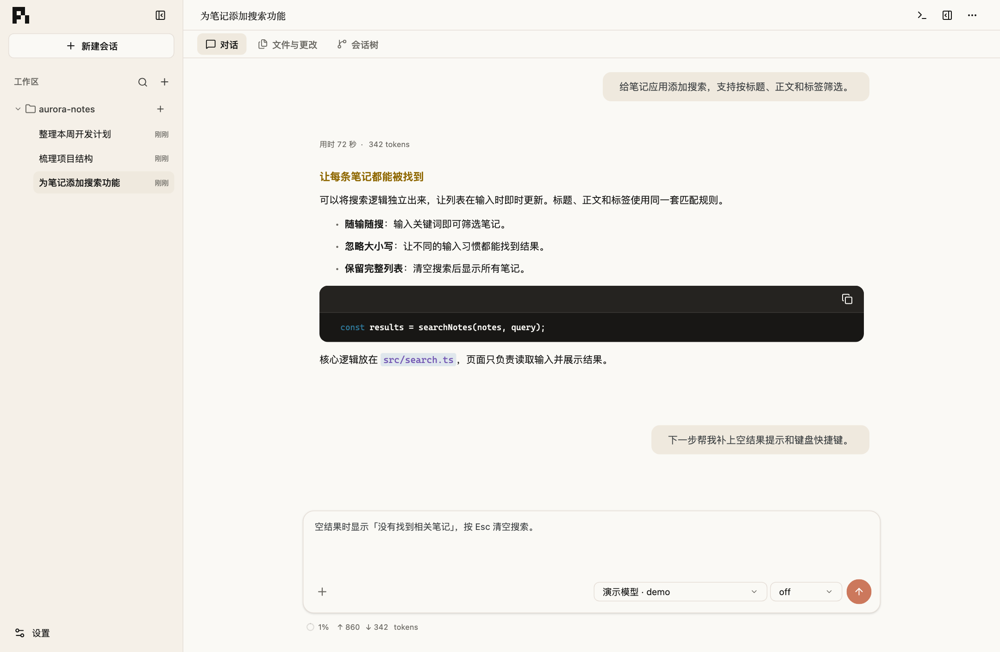
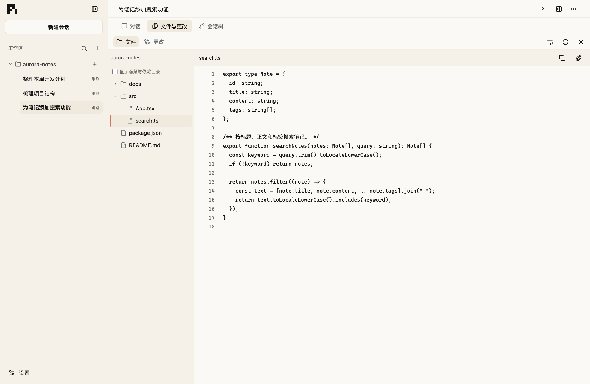
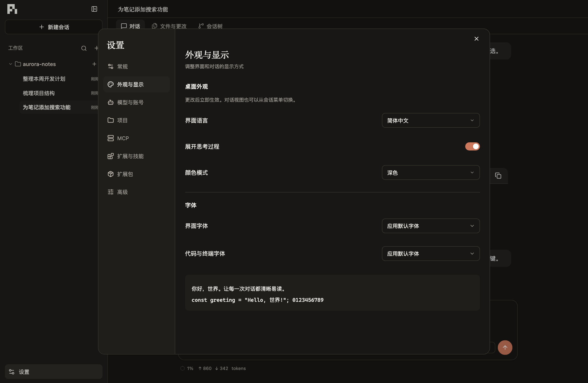

# Pi Desktop

**把 AI 编程助手带到桌面，让对话、项目文件和终端在一个工作区里协同。**

Pi Desktop 是 [Pi](https://github.com/earendil-works/pi) 的图形化桌面应用。打开项目文件夹，用自然语言描述任务，就能与 AI 一起阅读代码、修改文件、运行命令，并查看每一步的结果。

支持 **Windows 和 macOS**，提供 **简体中文 / English** 界面。

[下载安装](https://github.com/KMMoonlight/pi-desktop/releases/tag/v0.1.1) · [反馈问题](https://github.com/KMMoonlight/pi-desktop/issues)

*应用截图使用独立演示项目和示例对话。*

## 在一个工作区里完成任务

- **围绕项目组织对话**：按工作区管理会话，随时搜索、固定和继续之前的讨论。
- **看清 AI 的工作过程**：实时阅读回复，查看工具执行结果；任务进行中也可以补充要求或停止运行。
- **让文件成为上下文**：浏览项目、预览文件、附加图片和文件，直接检查 Git 更改。
- **随时打开终端**：在应用内运行 Shell，与对话配合完成项目中的操作。
- **探索不同思路**：通过会话树回看历史、创建分支，或导出对话以便留存。
- **按习惯配置助手**：选择模型与思考等级，管理账号、MCP、扩展和技能，并调整语言、主题与字体。

## 项目文件，随时查看

从对话切换到「文件与更改」，浏览目录、查看代码和修改内容。返回对话时，尚未发送的草稿仍会保留。

## 让工作区更顺手

支持浅色与深色外观，也可以分别设置界面字体、代码与终端字体。语言和显示偏好都能在设置中调整。

## 下载与安装

前往 [GitHub Releases](https://github.com/KMMoonlight/pi-desktop/releases) 下载适合设备的安装包：

| 设备 | 下载 |
| --- | --- |
| Windows x64 | [Windows 安装器（.exe）](https://github.com/KMMoonlight/pi-desktop/releases/download/v0.1.1/Pi-Desktop_0.1.1_windows-x64-setup.exe) |
| Mac Apple Silicon（M 系列芯片） | [Apple Silicon 安装包（.dmg）](https://github.com/KMMoonlight/pi-desktop/releases/download/v0.1.1/Pi-Desktop_0.1.1_macos-arm64.dmg) |

Windows 按安装器提示完成安装；macOS 打开 `.dmg`，将 Pi Desktop 拖入「应用程序」。无需另外安装 Node.js 或 Pi。

当前为 **v0.1.1 测试预发布版**，尚未配置正式代码签名和 Apple 公证，系统可能显示安全提示。

## 开始使用

1. 打开应用，在「设置 → 模型与账号」中配置模型服务与凭据。
2. 添加一个项目文件夹作为工作区。
3. 新建会话，描述你想完成的任务；需要时附加文件或图片。
4. 查看回复、执行结果和文件更改，继续补充要求。

例如：

> 帮我梳理这个项目的结构，说明启动方式，再列出值得优先改进的三个地方。

会话会保存在本地，重新打开工作区即可继续。模型请求由你配置的服务提供，费用以该服务为准；Git 和其他外部工具需要在设备上另行安装。

## 更多信息

遇到问题或有功能建议，欢迎提交 [Issue](https://github.com/KMMoonlight/pi-desktop/issues)。

希望从源码运行或参与开发，请阅读 [开发与兼容性说明](docs/development.md)。
